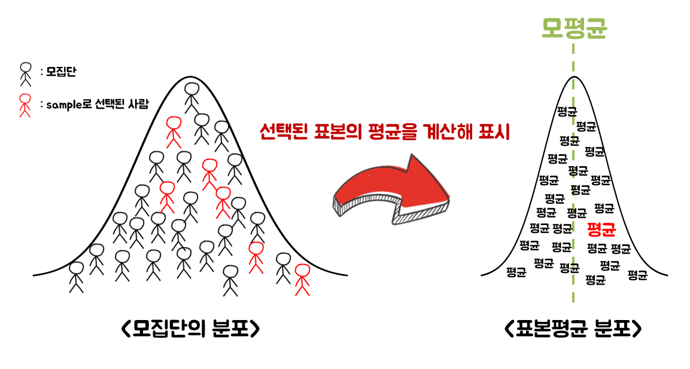

# 통계적 조사

모집단의 특성이나 성질을 조사하는 방법으로는 `전수조사`와 `표본조사`가 있다.

`전수조사`에서는 기술통계 방법을 사용해 모든 요소로부터 알고자 하는 성질을 계산하고 평가할 수 있다.

`표본조사`에서는 추론통계 방법을 통해 모집단을 추정하는 분석에 기반을 두고 있다.

### 데이터를 얻는다는 것

- 모집단에서 일부를 표본으로 추출한다는 것은, 모집단에 포함된 전체 값으로 구성된 분포에서 일부를 추출하는 것으로 정의된다.

- 모집단분포가 양적 변수의 분포라면 평균이나 분산을 정의할 수 있는데, 이를 각각 모평균과 모분산이라 한다. 일반적으로 이러한 모집단분포를 특징 짓는 것을 `모수` 또는 `파라미터(parameter)`라 부른다.

- 통게학에서는 모수를 아는 것이 목표이나, 모집단을 모두 조사하는 것은 현실적으로 어려움이 따르기 때문에 표본으로 모수를 추정한다.

### 모집단 분포 모형화

- 수학적으로 다룰 수 있는 확률분포(모형)로 모집단 분포를 근사하는 것을 `모형화(modeling)`으로 정의한다.

### 무작위추출
 - 모집단에서 데이터를 추출할 때에 무작위로 선택하여 추출하는 것을 `무작위추출(random sampling)`으로 정의한다.
 - 가장 이상적인 무작위추출 방법은 표본에 있을 수 있는 모든 원소를 목록으로 만들고, 난수를 이용하여 표본을 정하는 것이다. 이를 `단순무작위추출법`이라 한다. 다만, 이 방법은 노력과 시간 비용으로 인해 현실적으로 시행하기 어려울 수 있다.
 - 보편적으로 사용되는 무작위추출 방법으로는 `층화추출법`이 있다. 이는 모집단을 몇 개의 층(집단)으로 미리 나눈 뒤, 각 층에서 필요한 수의 조사대상을 무작위로 추출하는 방법이다.
 - 이 외에도 `계통추출법`, `군집추출법` 등 다양한 방법이 존재한다.

# 표본오차와 신뢰구간 
아래는 표본으로 모집단의 평균을 추정하는 예시이다.

표본에서 실제 얻은 값으로 모집단의 성질을 추정하기 위해서는, 수집한 데이터(표본평균)와 알고 싶은 값(모집단평균) 사이의 오차가 어떤 값이 될지를 고려해야 한다.

모집단의 평균 $\mu$나 표준편차 $\sigma$ 등은 고정된 값이지만, 모집단 분포에서 얻은 표본 $x_1, x_2,...,x_n$은 확률변수이다.

### 표본오차

일반적으로 표본평균은 모집단평균 $\mu$와 일치하지 않는다. 즉, 오차가 발생할 수 있음을 의미하며 이런 경우에 `표본오차(sampling error)`가 발생했다고 표현한다.

표본오차는 표본을 추출할 때의 인위적인 실수나 잘못으로 생기는 오차가 아니라, 모집단에서 확률적으로 무작위 표본을 고르는 것에서 발생하는 오차임에 주의한다. 표본오차는 평균값에 국한되지 않으며, 모집단의 다양한 성질에 대해서 일반적으로 발생하는 것으로 간주할 수 있다.

### 큰 수의 법칙

표본평균과 모집단평균의 관계에는 `큰 수의 법칙(law of large numbers)`이 성립한다. 이는 표본크기 $n$이 커질수록 표본평균 $\bar x$가 모집단평균 $\mu$에 한없이 가까워진다는 법칙이다. 즉, 표본오차 = $\bar x - \mu$가 $0$에 한없이 가까워진다는 뜻이기도 하다.

세부적으로는 `약한(weak)` 정의와 `강한(strong) 정의`가 있음을 참고하자.

- 약한 큰 수의 법칙 : $\lim_{n \to \infin} \Pr(|\overline{X}_n - \mu| < \epsilon)=1$

- 강한 큰 수의 법칙 : $\Pr( \lim_{n \to \infin} \overline{X}_n = \mu)=1$

### 중심극한정리

표본오차의 분포에 관해 중요한 정보를 제공하는 것이 `중심극한정리(central limit theorem)`이다. 이는 모집단이 어떤 분포이던 간에, 동일한 확률분포를 가진 독립 확률 변수 $n$개의 평균의 분포는 $n$이 커질수록 정규분포에 가까워진다는 정리이다.

표본크기 $n$이 커질수록 표본평균의 분포는 다음과 같은 정규분포 N$(\mu, \frac{\sigma}{\sqrt{n}})$로 근사할 수 있다.

### 추정량
모집단의 성질을 추정하는데 사용하는 통계량
 - 일치추정량 : 표본크기 $n$을 무한대로 했을 때, 모집단의 성질과 일치하는 추정량
 - 비편향추정량 : 추정량의 평균값(기댓값)이 모집단의 성질과 일치할 때의 추정량

비편향추정량은 통계적으로 모집단의 성질을 편향되지 않게 나타내는 통계량을 뜻한다.

- 표본평균은 모집단평균 $\mu$를 편향되지 않게 추정하는 비편향추정량이다. 

- 표본표준편차(또는 표본분산)는 비편향성을 위해 모표준편차와는 달리 자유도($n-1$)를 고려하여 나눈 값으로 정의된다.

### 표본오차의 분포

표본크기 $n$이 커질수록 표본오차 $\bar x-\mu$의 분포는 다음 정규분포 N$(0, \frac{\sigma}{\sqrt{n}})$로 근사된다.

표본오차의 분포는 모집단의 표준편차 $\sigma$와 표콘크기 $n$ 2개의 값만 정해지면 알 수 있다. 여기서 $\sigma/\sqrt{n}$ 을 `표준오차(standard error)`라 한다. $\sigma$는 모집단의 성질이므로, 표본에서 추정한 비편향표준편차 $s$를 $\sigma$ 대신 사용하여 $s/\sqrt{n}$을 표준오차로 삼는다. 이 때, 표본오차는 정규분포가 아니라, 정규분포와 닮은 `t분포`를 따르게 된다.

즉, t분포는 모집단이 정규분포라는 가정하에 미지의 모집단 표준편차 $\sigma$를 표본으로 계산한 비편향표준편차 $s$로 대용했을 때, $\bar x-\mu$를 표준오차 $s/\sqrt{n}$으로 나누어 표준화한 값이 따르는 분포이다.

### 신뢰구간

표본오차의 확률분포를 통해 오차가 어느 정도의 확률로 나타나는지를 표현할 수 있다. 오차를 정량화하기 위해 `신뢰구간(confidence inrterval)`은 모수가 어느 범위 안에 있는지를 확률적으로 보여주는 것으로 정의된다.

신뢰 구간은 보통 표본에서 산출된 통계와 함께 제공된다. 예를 들어, "신뢰수준 95%에서 투표자의 35%~45%가 $x$ 후보를 지지하고 있다."라고 할 때 95%는 신뢰수준이고 35%~45%는 신뢰구간이며 모수($\theta$)는 $x$ 후보의 지지율이다. 

### t분포를 사용할 때 주의할 점

표본크기 $n$이 작아도 적용 가능한 t분포에는, '정규분포에서 얻은 데이터'라는 가정이 필요하다. 데이터의 배경에 있는 모집단분포가 완벽한 정규분포인 것은 현실적으로 어렵기 때문에, 계산한 95% 신뢰구간 또한 엄밀한 95%가 아니라는 점에 주의한다.

특히 문제가 되는 것은 정규분포와 현저하게 다른 분포에서 데이터를 얻었을 때이다. 단, 표본크기 $n$이 클 때에는 중심극한정리에 따라 모집단이 정규분포가 아니더라도 표본평균을 정규분포로 근사할 수 있으므로 신뢰구간의 정확해진다.